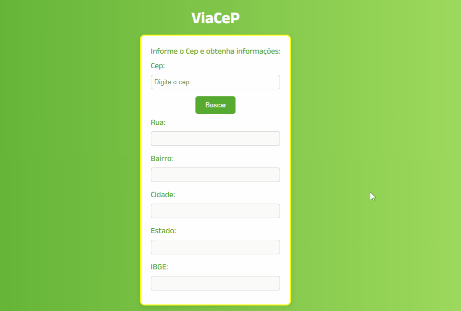

# Projeto ViaCep

Este projeto tem como objetivo o aprimoramento prático com React + Vite, por meio da construção de uma aplicação que realiza a busca de informações com base no cep informado pelo usuário.

A aplicação utiliza uma API externa para consultar os dados e apresenta os resultados de forma dinâmica, além de garantir responsividade em dispositivos de telas menores. Como também, utiliza o Typescript para definição dos tipos personalizados.

## Índice

- [Visão geral](#visãogeral)
  - [O projeto](#o-projeto)
  - [Link](#link)
- [Meu processo](#meu-processo)
  - [Tecnologias utilizadas](#built-with)
  - [Aprendizados](#aprendizados)
   - [Funcionalidades](#funcionalidades)
- [Instalação e execução do projeto](#instalação-e-execução-do-projeto)
- [Autora](#autora)

## Visão geral

### O projeto

### Link

## Meu processo

### Tecnologias utilizadas

 - React
 - Vite
 - Typescript
 - Styled Components
 - React Hook Form
 - API ViaCEP

 ### Aprendizados

 Com este projeto, pude consolidar meus conhecimentos de React, configurando um ambiente moderno e dinâmico.

 Pude trazer um visual agradável ao usuário, por meio da estilização com Style components.

 Obtive melhora no desempenho com o uso de API's externas, na busca de dados reais, utilizando o fetch.

 Aprendi a lidar com possíveis erros de um formulário e tratá-los de forma dinâmica, com o React Hook form.

 Consegui trabalhar com o Typescript, facilitando a organização e legibilidade do código.

 Além de aprimorar a minha prática de trabalhar em projetos que trazem responsividade em telas menores, melhorando a experiência do usuário.

### Funcionalidades

 - Campo de input para inserir o cep
 - Validação do campo com React Hook Form
 - Requisição à API ViaCEP para obter os dados
 - Exibição dos dados de forma dinâmica
 - Layout responsivo adaptado para diferentes telas

 ### Instalação e execução do projeto

 1. Clone o projeto: git clone https://github.com/seu-usuario/viaCep-project-react

 2. Instale as dependências com o comando: npm install ou npm i

 3. Inicie o servidor de desenvolvimento: npm run dev

 ## Autora

 https://github.com/mandiilorenzo

